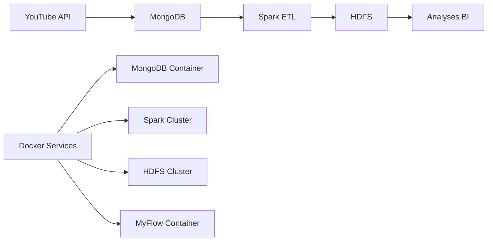

# 🎬 Workflow YouTube avec Docker

Ce guide explique comment lancer le workflow YouTube complet dans Docker.

## 📋 Prérequis

1. **Docker et Docker Compose** installés
2. **Clé API YouTube Data v3** (obtenez-la sur [Google Cloud Console](https://console.cloud.google.com/))

## 🚀 Démarrage rapide

### 1. Configuration

```bash
# Cloner le projet (si pas déjà fait)
git clone <votre-repo>
cd Ad_Trackr

# Créer le fichier .env avec votre clé API
cp .env.example .env
# Éditez .env et remplacez YOUR_YOUTUBE_API_KEY par votre vraie clé
```

### 2. Lancement automatique

```bash
# Lancer le workflow complet
./start_youtube_workflow.sh
```

### 3. Lancement manuel

```bash
# Démarrer l'infrastructure
docker-compose up -d

# Attendre que les services soient prêts (30 secondes)
sleep 30

# Tester l'infrastructure
python test_docker_setup.py

# Lancer le workflow YouTube
docker exec -it datalake-myflow python examples/youtube_ingestion_workflow.py
```

## 🏗️ Architecture

Le workflow suit cette architecture :



## 📊 Services disponibles

| Service | URL | Description |
|---------|-----|-------------|
| MongoDB Express | http://localhost:8082 | Interface web MongoDB (admin/admin) |
| HDFS NameNode | http://localhost:9870 | Interface web HDFS |
| Spark Master | http://localhost:8086 | Interface web Spark Master |
| Spark Worker | http://localhost:8087 | Interface web Spark Worker |

## 🔧 Configuration

### Variables d'environnement (.env)

```bash
# YouTube API
YOUTUBE_API_KEY=votre_cle_api_youtube

# MongoDB
MONGO_HOST=mongo
MONGO_PORT=27017
MONGO_USER=admin
MONGO_PASSWORD=password123

# HDFS
HDFS_HOST=namenode
HDFS_PORT=9870

# Spark
SPARK_MASTER_URL=spark://spark-master:7077
```

## 🧪 Tests

### Test de l'infrastructure

```bash
python test_docker_setup.py
```

### Test individuel des composants

```bash
# Test MongoDB
docker exec datalake-mongo mongosh --eval "db.runCommand('ping')"

# Test HDFS
curl http://localhost:9870

# Test Spark
curl http://localhost:8086
```

## 📝 Workflow détaillé

Le workflow YouTube suit ces étapes :

1. **Vérification de l'environnement** - Variables d'environnement et clé API
2. **Health checks** - MongoDB et HDFS accessibles
3. **Extraction YouTube** - API → MongoDB
4. **ETL Spark** - MongoDB → HDFS (agrégation des influenceurs)
5. **Validation** - Tests des capacités de recherche

## 🐛 Dépannage

### Problèmes courants

1. **Clé API YouTube invalide**
   ```bash
   # Vérifiez votre clé dans .env
   cat .env | grep YOUTUBE_API_KEY
   ```

2. **Services non démarrés**
   ```bash
   # Vérifiez l'état des conteneurs
   docker-compose ps
   
   # Redémarrez si nécessaire
   docker-compose restart
   ```

3. **Problème de connexion MongoDB**
   ```bash
   # Vérifiez les logs MongoDB
   docker logs datalake-mongo
   ```

4. **Problème de connexion HDFS**
   ```bash
   # Vérifiez les logs HDFS
   docker logs datalake-namenode
   ```

### Logs utiles

```bash
# Logs du workflow
docker logs datalake-myflow

# Logs MongoDB
docker logs datalake-mongo

# Logs HDFS
docker logs datalake-namenode

# Logs Spark
docker logs datalake-spark-master
```

## 📈 Résultats

Après exécution réussie, vous trouverez :

- **Données brutes** dans MongoDB (`datalake.raw_data`)
- **Données agrégées** dans HDFS (`/data/youtube/`)
- **Tables optimisées** pour recherche par influenceur, niche, etc.

## 🔍 Requêtes d'exemple

Une fois les données dans HDFS, vous pouvez faire des requêtes comme :

```sql
-- Top influenceurs par vues
SELECT influencer_name, total_views, engagement_rate
FROM influenceurs_search 
ORDER BY total_views DESC 
LIMIT 10;

-- Influenceurs Gaming
SELECT influencer_name, total_videos, total_views
FROM influenceurs_search 
WHERE main_niche = 'Gaming'
ORDER BY total_views DESC;

-- Recherche par nom
SELECT * FROM influenceurs_search 
WHERE LOWER(influencer_name) LIKE '%tech%';
```

## 🛑 Arrêt

```bash
# Arrêter tous les services
docker-compose down

# Arrêter et supprimer les volumes (ATTENTION: supprime les données)
docker-compose down -v
```

## 📚 Documentation supplémentaire

- [Guide d'architecture](architecture_diagram.md)
- [Documentation MyFlow](myflow/docs/)
- [Exemples d'utilisation](myflow/examples/)
